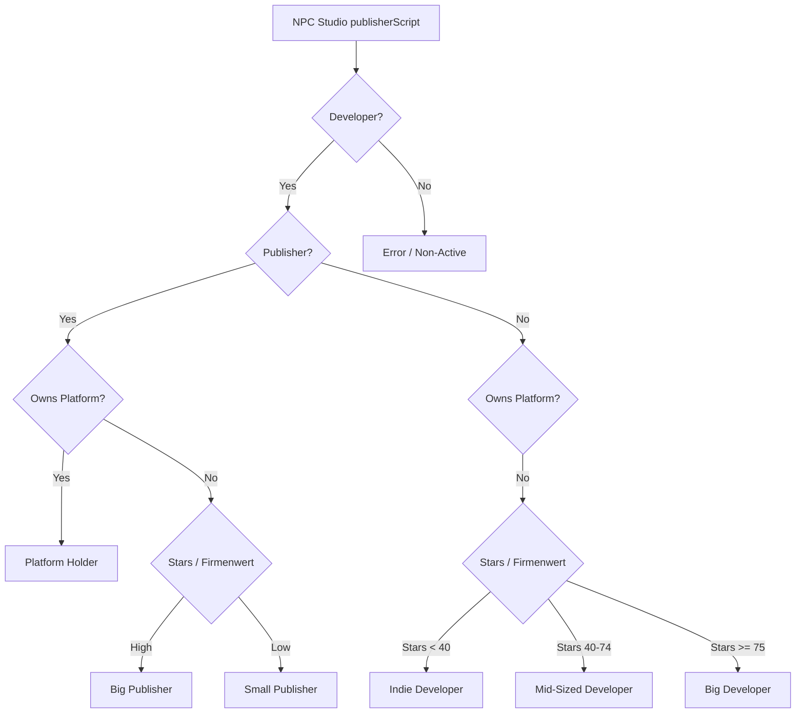

# Mad Games Tycoon 2 - NPC Studio Segmentation & Progression Tiers
## Updated Design Document & Interaction Guide

This document defines the classification system, relationship-building/decreasing actions, and progression perks for the **Relationships and Partnerships Overhaul Mod**, incorporating user feedback on placing developer dynamic growth and interactive dialogues on hold.

---

## 1. The Studio Classification System

To support unique interactions, every NPC studio (`publisherScript`) is classified into a subdivision.

### A. Classification Formulas & Logic
1. **Platform Holders (Static)**:
   * **Condition**: `publisher == true && ownPlatform == true` (e.g. Sony, Nintendo, Microsoft, Sega).
2. **Big Publishers (Static)**:
   * **Condition**: `publisher == true && ownPlatform == false && stars >= 70f` (or base firm value >= $20M).
3. **Small Publishers (Static)**:
   * **Condition**: `publisher == true && ownPlatform == false && stars < 70f` (or base firm value < $20M).
4. **Indie Developers (Static for now)**:
   * **Condition**: `developer == true && publisher == false && stars < 40f` (or base firm value < $2M).
5. **Mid-Sized Developers (Static for now)**:
   * **Condition**: `developer == true && publisher == false && stars >= 40f && stars < 75f` (or base firm value between $2M and $15M).
6. **Big Developers (Static for now)**:
   * **Condition**: `developer == true && publisher == false && stars >= 75f` (or base firm value >= $15M).

### B. Developer Dynamic Growth System (ON HOLD)
> [!NOTE]
> **This feature is currently ON HOLD.** In the vanilla game, NPC studios do not dynamically gain or lose stars organically over time. Until a star-progression system is implemented for NPCs, all studio classifications will remain **static** based on their starting parameters at the beginning of the playthrough.

---

## 2. Subdivision-Specific Relationship Matrix

Relationships are tracked from `0` to `100` points, rendered as **1 to 5 Stars/Hearts** (each star represents 20 points). Using or activating a perk awards additional relationship points as defined below.

### Subdivision 1: Platform Holders (Sony, Nintendo, Sega, etc.)
* **How to Improve Relationship**:
  * Release games on their console (`+3` points per game).
  * Release a good game (**80+ review**) on their console (even if multiplatform) (`+5` points).
  * Release a masterpiece (**90+ review**) on their console (even if multiplatform) (`+10` points).
  * High sales on their console (licensing royalties) (`+10` points for hits).
  * Make a console-exclusive game for them (`+30` points).
  * Accept their development commissions (`+20` points).
* **How to Decrease Relationship**:
  * Release games exclusive to a rival console (`-30` points).
  * Cancelling a console-exclusive contract midway (`-50` points).
  * Releasing very low-rated games (flops/bugs) on their console (`-5` to `-15` points).
* **CRITICAL RIVALRY RULE**: As soon as the player puts a console hardware out in the market, **all platform holder actions and perks become permanently unavailable** as they are now rivals. The relationship with all platform holders instantly drops to **1 Star** (20 points) and remains locked.

| Tiers | Points | Perk Unlocks, NPC Interactions, & Point Gains |
| :--- | :--- | :--- |
| **1 Star** | `20` | **Gameplay Instant-Unlock**: Instantly unlocks a free gameplay feature element without needing any time, a research room, or money. Cooldown: **Once every 2 months**.  *Relationship Gain on Use*: `+2` points. |
| **2 Stars** | `40` | **Engine Instant-Unlock**: Instantly unlocks a free engine research element without needing any time, a research room, or money. Cooldown: **Once every 3 months**.  *Relationship Gain on Use*: `+3` points. |
| **3 Stars** | `60` | **Tech Sharing / Publishing Deal**: Act as publisher for your game at a premium royalty rate better than any other NPC publisher, even if it's on other platforms (marketing rights deal). Can be a brand new project (goes to game creation menu) or an in-development project (select from list). Cooldown: **Once every 3 years**.  *Relationship Gain on Use*: `+10` points. |
| **4 Stars** | `80` | **Exclusivity / Full Funding**: Ability to make 1 game exclusive to their platform. They cover the **entire funding/budget of the game** (reimburse 100% of money spent on the project each month). They publish the game, and it must remain exclusive. Can be a brand new project or in-development project.  *Cancellation Penalty*: **If the game is in development and multiplatform, all other platforms are cancelled.** Cooldown: **Once every 5 years**.  *Relationship Gain on Use*: `+15` points. |
| **5 Stars** | `100` | **First-Party Partner / Debt Bailout**: Instantly bail out all player debt and receive cash to fund your next game. In exchange, **they take all of your game IPs**. Limit: **Only once per playthrough**.  *Relationship Gain on Use*: `+30` points. |

---

### Subdivision 2: Big Publishers (EA, Activision, Ubisoft, etc.)
* **How to Improve Relationship**:
  * **Use them normally for publishing a game** (without any special perk/deal) (`+5` points per game).
  * Sign publishing deals for your games with them and secure hits (`+20` points).
  * Complete contract games for them with high reviews (`+15` points).
  * Co-publish AAA games together (`+25` points).
* **How to Decrease Relationship**:
  * Cancel a signed publishing contract or contract game in development (`-30` points).
  * Decline their contract game offers repeatedly (`-5` points per decline).
  * Releasing games that compete with their key franchises in the same month (`-10` points).

| Tiers | Points | Perk Unlocks, NPC Interactions, & Point Gains |
| :--- | :--- | :--- |
| **1 Star** | `20` | **Topic Instant-Unlock**: Instantly unlocks a free topic element without needing any time, a research room, or money. Cooldown: **Once every month**.  *Relationship Gain on Use*: `+1` point. |
| **2 Stars** | `40` | **Trusted Partner / Signing Bonus**: Better publishing royalty rate than standard + a signing bonus depending on game size (B, B+, A, AA, AAA, or AAAA). Can be a brand new project or an in-development project. Cooldown: **Once every 2 years**.  *Relationship Gain on Use*: `+8` points. |
| **3 Stars** | `60` | **IP Cooperation / Partial Funding**: Use their IPs to make sequels/spin-offs. They own the IP. Player chooses the funding % they want to receive (publisher returns that % of monthly costs). The higher the funding %, the worse the publishing royalties the player receives (and vice versa). Cooldown: **Once every 3 years**.  *Relationship Gain on Use*: `+12` points. |
| **4 Stars** | `80` | **AAA Co-Publishing Pitch**: Pitch a game using their IP (sequel/spin-off), our IP (sequel/spin-off), or a new IP. They fund 50-100% of the game costs (returned each month).  1. *New IP*: Option to give them the IP rights for 100% funding and good royalties, or keep the IP for 50% funding and slightly worse royalties.  2. *Player IP*: Keep IP, get 50% funding and a fair royalty deal.  3. *Their IP*: Get 75% funding and a good royalty deal.  *Note: Brand new projects only. Cooldown: **Once every 3 years**.*  *Relationship Gain on Use*: `+15` points (plus another `+20` points if you gift them a new IP). |
| **5 Stars** | `100` | **Acquisition & Consolidation**:  1. Ability to fully acquire the studio as a subsidiary.  2. Full right to make games in any of their IPs with good royalties and 50-100% funding (depending on IP importance). Cooldown: **Once every 5 years**.  3. *If player has console*: Force their in-development game to be exclusive to your console by paying an upfront fee (based on IP and game size B to AAAA), or put their games on your subscription service for a lower but high fee. Cooldown: **Once every 3 years**.  *Relationship Gain on Actions*: `+20` points for exclusivity/subscription deals. |

---

### Subdivision 3: Small Publishers (Devolver, Annapurna, etc.)
* **How to Improve Relationship**:
  * **Use them normally for publishing a game** (without any special perk/deal) (`+5` points per game).
  * Publish their developed games (`+20` points).
  * Buy/Sell indie IPs to them (`+10` points).
  * Send technology gifts or free engine licenses (`+15` points).
* **How to Decrease Relationship**:
  * Releasing games through self-publishing or other publishers when they offered a contract (`-15` points).
  * Cancelling active publishing agreements midway (`-25` points).

| Tiers | Points | Perk Unlocks, NPC Interactions, & Point Gains |
| :--- | :--- | :--- |
| **1 Star** | `20` | **Basic Contact**: Give you a standard publishing offer, and publishing with them increases relationship.  *Relationship Gain on Use*: `+3` points per published game. |
| **2 Stars** | `40` | **Indie Sponsor**: Better publishing rate + upfront signing bonus depending on IP and game size (B to AAAA).  *Relationship Gain on Use*: `+5` points. |
| **3 Stars** | `60` | **First-Look / IP Trades & Buyouts**: They always offer games to you to publish first. They are willing to buy player's IPs at a good rate. Player can use their IPs to make sequels/spin-offs (similar to Big Publisher's IP Cooperation, but the funding is capped at a significantly lower level, max **40% funding**). Cooldown: **Once every 3 years**.  *Relationship Gain on Use*: `+10` points (or `+15` points if you buy their IP). |
| **4 Stars** | `80` | **Exclusivity & Subscription Service**: *If player has console*: Force their in-development game to be exclusive to your console by paying an upfront fee (based on IP and size B to AAAA), or put their games on your subscription service for a lower fee. Cooldown: **Once every 2 years**.  *Relationship Gain on Use*: `+15` points. |
| **5 Stars** | `100` | **Friendly Absorption**: Fully buy out and acquire the entire studio.  *Relationship Gain on Use*: `+25` points. |

---

### Subdivision 4: Big Developers (FromSoftware, Capcom, CDPR, etc.)
* **How to Improve Relationship**:
  * Publish their games and secure high sales (`+20` points).
  * License your engine to them with 0% royalty (`+15` points).
  * Direct co-development projects (`+20` points).
* **How to Decrease Relationship**:
  * Publishing their games and getting extremely poor reviews/sales due to poor marketing/pricing (`-15` points).
  * Cancelling a signed publishing contract for their game (`-30` points).

| Tiers | Points | Perk Unlocks, NPC Interactions, & Point Gains |
| :--- | :--- | :--- |
| **1 Star** | `20` | **Basic Dev**: Act as publisher for their in-development game. If it does well, gain extra relationship points. Must offer a good upfront amount or a good royalty deal (or balanced).  *Relationship Gain on Use*: `+5` points. |
| **2 Stars** | `40` | **Preferred Publisher / IP Licensing**: They allow us to make games in their IP. We publish it if we have a publishing room; if not, they decide the publisher and we get a good publishing deal. They also provide 15% - 35% funding depending on game size and IP value.  *Relationship Gain on Use*: `+10` points. |
| **3 Stars** | `60` | **Outsourcing & IP Purchase**:  1. *Outsourcing*: Assign them a project based on our IP or a new IP we will own. Player fully funds the project with a lump sum payment.  2. *IP Purchase*: Option to buy any one of their game IPs outright at a good rate. Limit: **Once every 10 years**.  3. *In-Dev Queue System*: Cancel current project (slight relation penalty `-10` points) or Queue project (relation boost `+15` points upon completion). Gift new IP: `+35` relationship points. |
| **4 Stars** | `80` | **Automatic Publication Contract**: All of their developed games are automatically published by us. We pay them a yearly amount (based on their Goodwill, IP value, and trend from Goodwill mod) and offer them a good publishing deal.  *Relationship Gain on Deal*: `+10` points initially, and `+5` points passively every year. |
| **5 Stars** | `100` | **Friendly Acquisition / IP Buyout**: Option to acquire the entire studio as a subsidiary with a 30% discount on firm value, or buy any one of their IPs (IP purchase cooldown: **Once every 10 years**).  *Relationship Gain on Acquisition*: `+20` points. |

---

### Subdivision 5: Mid-Sized Developers (Remedy, IO Interactive, Techland, etc.)
* **How to Improve Relationship**:
  * Co-finance/Fund their games (`+20` points).
  * License your engine (`+15` points).
  * Publish their games (`+15` points).
* **How to Decrease Relationship**:
  * Funding a game and then cancelling it or rejecting the final build (`-25` points).
  * Licensing your engine to them but charging full high royalties later or violating terms (`-15` points).

| Tiers | Points | Perk Unlocks, NPC Interactions, & Point Gains |
| :--- | :--- | :--- |
| **1 Star** | `20` | **Standard Dev**: Act as publisher for their in-development game. If it does well, gain extra relationship points. Must offer a good upfront amount or a good royalty deal (or balanced).  *Relationship Gain on Use*: `+4` points. |
| **2 Stars** | `40` | **Full Project Financing (Outsourcing)**: Assign them a project based on our IP or a new IP we will own. Player fully funds the project with a lump sum payment (based on studio stars, Goodwill reputation, size of game, IP value, and surplus).  *In-Dev Queue System*:  1. *Cancel Current*: Pay extra to force them to cancel their current project to work on ours (slight relationship penalty `-10` points).  2. *Queue System*: Put project in a queue; they start once done (relationship gain boost `+15` points when completed).  3. *IP Gift*: If it is a new IP, you can let them keep the IP for a massive relationship boost (`+40` points). |
| **3 Stars** | `60` | **Console Exclusivity & Subscription Service**: *If player has console*: Make their in-development game exclusive to your console by paying an upfront fee (based on IP and size B to AAAA), or put their games on your subscription service for a lower fee. Cooldown: **Once every 3 years**.  *Relationship Gain on Use*: `+12` points. |
| **4 Stars** | `80` | **Automatic Publication Contract**: All of their developed games are automatically published by us. We pay them a yearly amount (based on their Goodwill, IP value, and trend from Goodwill mod) and offer them a good publishing deal.  *Relationship Gain on Deal*: `+10` points initially, and `+5` points passively every year. |
| **5 Stars** | `100` | **Acquisition Option**: Acquire the entire studio as a subsidiary with a 40% discount, or buy any one of their IPs (IP purchase cooldown: **Once every 10 years**).  *Relationship Gain on Acquisition*: `+20` points. |

---

### Subdivision 6: Indie Developers (Small Startups)
* **How to Improve Relationship**:
  * Fully fund their games (`+30` points).
  * Offer free engine licenses (`+20` points).
  * Publish their first game (`+20` points).
* **How to Decrease Relationship**:
  * Cancelling their funded game midway, forcing them to waste development time (`-30` points).
  * Buying their IP for cheap and then burying it in the archives (not releasing sequels, `-15` points).

| Tiers | Points | Perk Unlocks, NPC Interactions, & Point Gains |
| :--- | :--- | :--- |
| **1 Star** | `20` | **In-Development Publisher**: Act as publisher for their in-development game. If it does well, gain extra relationship points. Must offer a good upfront amount or a good royalty deal (or balanced).  *Relationship Gain on Use*: `+5` points. |
| **2 Stars** | `40` | **Full Project Financing (Outsourcing)**: Assign them a project based on our IP or a new IP we will own. Player fully funds the project with a lump sum payment (based on studio stars, Goodwill reputation, size of game, IP value, and surplus).  *In-Dev Queue System*:  1. *Cancel Current*: Pay extra to force them to cancel their current project to work on ours (slight relationship penalty `-10` points).  2. *Queue System*: Put project in a queue; they start once done (relationship gain boost `+15` points when completed).  3. *IP Gift*: If it is a new IP, you can let them keep the IP for a massive relationship boost (`+40` points). |
| **3 Stars** | `60` | **Automatic Publication Contract**: All of their developed games are automatically published by us. We pay them a yearly amount (based on their Goodwill, IP value, and trend from Goodwill mod) and offer them a good publishing deal.  *Relationship Gain on Deal*: `+10` points initially, and `+5` points passively every year. |
| **4 Stars** | `80` | **Console Exclusivity & Subscription Service**: All of their games exclusive to our console plus day one on our subscription service (only if we have a console in market or have an active subscription service). We pay them a yearly amount (based on their Goodwill, IP value, and trend from Goodwill mod) and offer them a good publishing deal.  *Relationship Gain on Deal*: `+15` points initially, and `+5` points passively every year. |
| **5 Stars** | `100` | **Acquire Studio**: Ability to acquire the entire studio as a subsidiary.  *Relationship Gain on Acquisition*: `+20` points. |

---

## 3. Dynamic Interaction Archetypes & Dialogues (ON HOLD)
> [!NOTE]
> **This feature is currently ON HOLD.** Detailed dialogue popups and custom negotiation flows are deferred to focus strictly on relationship thresholds and menu-action checks to maintain a cleaner, more stable script footprint for the initial release.
